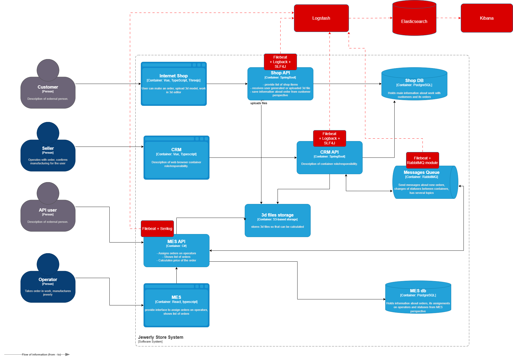

# Архитектурное решение по логированию

## 1. Анализ системы и источников логов

На основании C4-диаграммы и описания архитектуры, логирование нужно внедрить для следующих компонентов:

### Ключевые точки логирования:
- **Shop API** (`Spring Boot`)
- **CRM API** (`Spring Boot`)
- **MES API** (`C#`)
- **Messages Queue (RabbitMQ)`** — для мониторинга успешной/неуспешной доставки сообщений.
- **3D File Storage** — для отслеживания загрузок, удаления, и ошибок чтения/записи файлов.

## 2. Список логов (уровень INFO)

Пример событий для логирования:

| Событие                      | Система               | Уровень  | Поля |
|-----------------------------|-----------------------|----------|------|
| Изменение статуса заказа    | MES / CRM / Shop API  | INFO     | timestamp, order_id, user_id, status_from, status_to |
| Ошибка расчёта стоимости    | MES API               | ERROR    | timestamp, order_id, model_file_id, error_message |
| Потеря сообщения RabbitMQ   | Все                   | WARN     | timestamp, source_service, target_service, message_id |
| Загрузка файла              | Shop API / Storage    | INFO     | timestamp, file_name, size, user_id |
| Тайм-аут расчёта > 10 минут | MES API               | WARN     | timestamp, order_id, duration_sec |

### Дополнительные уровни:
- `DEBUG`: используется в dev-среде (в проде только при отладке).
- `ERROR`: необработанные исключения.
- `WARN`: потенциально опасные ситуации.
- `INFO`: изменение состояния и бизнес-события.

## 3. Мотивация

Внедрение логирования позволит:
- Сократить время на разбор инцидентов.
- Повысить прозрачность обработки заказов.
- Упростить анализ производительности и узких мест.
- Улучшить SLA поддержки и восстановление после ошибок.
- Предотвратить потерю крупных заказов.

### Метрики, на которые влияет логирование:
- MTTR (Mean Time To Recovery).
- Кол-во необработанных инцидентов.
- Процент успешных заказов без вмешательства.
- Доля автоматически диагностируемых сбоев.

## 4. Приоритеты: где внедрять в первую очередь

| Приоритет | Система      | Причина |
|-----------|--------------|---------|
| 1         | MES API      | Самое узкое место (медленный UI, долгие расчёты) |
| 2         | RabbitMQ CRM | Потери сообщений, расхождение статусов |
| 3         | Shop API     | Источник заказов, загрузка файлов |

## 5. Предлагаемое решение

Ссылка на диаграму: `./logging_diagram.drawio`

### Технологии:
- `Logback + SLF4J` (для Java/Spring Boot)
- `Serilog` (для C#/.NET)
- `ELK стек` (Elasticsearch + Logstash + Kibana)
- `Filebeat/FluentBit` — сбор логов с EC2
- `Kafka` — опционально как транспортный слой

### Безопасность:
- Аутентификация в Kibana.
- Маскирование полей: email, phone, password.
- Доступ по ролям: только инженеры поддержки и админы.

### Хранение:
- Индексы в Elasticsearch разбиты по микросервисам.
- Время хранения:
  - `ERROR/WARN` — 90 дней
  - `INFO` — 30 дней
  - `DEBUG` — 7 дней (dev/staging)
- Ротация логов — по размеру (например, 5 ГБ на сервис)

## 6. Алертинг / анализ:

- Настройка алертов:
  - более 5 ошибок расчёта стоимости за 10 мин
  - Потерянные сообщения в очереди
  - Задержка изменений статуса более 5 мин
- Визуализация логов в Kibana Dashboard
