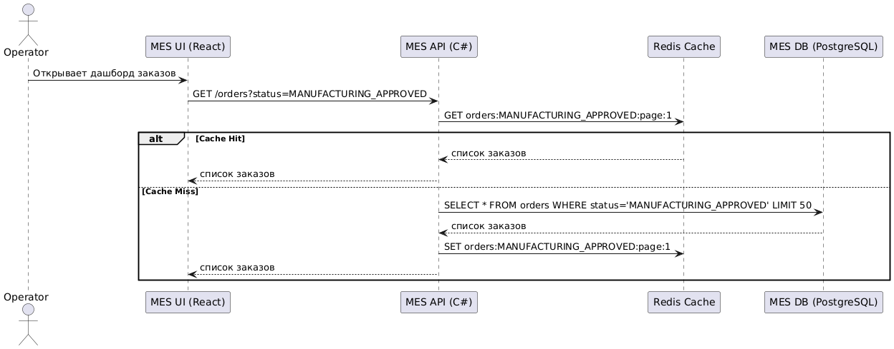
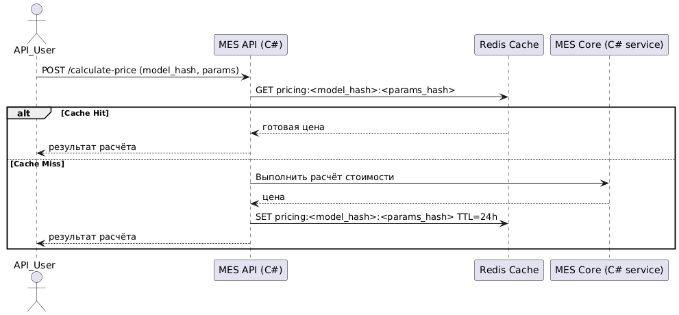

# Архитектурное решение по кешированию

## 1. Анализ проблемы

### Основные жалобы:
- Операторы жалуются на задержку в MES при загрузке первой страницы — отображается список заказов по статусам.
- Пользователи API жалуются на долгий расчёт стоимости изделий, особенно при сложных 3D-моделях.

### Потенциальные точки кеширования:
- Список заказов в MES (для интерфейса операторов).
- Результаты расчёта стоимости (если входные данные идентичны — можно кешировать).
- Метаданные 3D-файлов (например, предварительный просмотр, хэш модели и т.д.).

## 2. Мотивация

**Кеширование необходимо для:**
- Ускорения загрузки интерфейса операторов MES.
- Повышения отзывчивости при повторных расчётах стоимости заказа.
- Разгрузки базы данных MES и бэкенда C#.
- Повышения производительности при пиковых нагрузках.

### Бизнес-эффекты:
- Уменьшение жалоб операторов → повышение мотивации.
- Снижение количества потерь заказов от B2B клиентов.
- Улучшение производительности без увеличения серверов.

## 3. Предлагаемое решение

### Тип кеширования:
**Серверное кеширование.**

- Клиентское кеширование не подойдёт, так как:
  - заказы меняются в реальном времени;
  - операторы работают с авторизованным интерфейсом;
  - B2B клиенты используют API.

#### 1. Кеширование заказов в MES

- **Паттерн:** Cache-Aside
- **Технология:** Redis
- **Что кешируем:** список заказов по статусам; только первые N заказов (например, N=50)
- **Ключ:** `orders:<status>:page:<n>`

**Почему Cache-Aside?**
- Позволяет отдавать свежие данные.
- Прост в реализации.
- Хорошо работает для чтения.
- Не мешает записи.

#### 2. Кеширование результатов расчёта стоимости

- **Паттерн:** Write-Through
- **Что кешируем:** хэш модели + параметры (материал, размер) → результат расчёта
- **TTL:** 24 часа
- **Ключ:** `pricing:<model_hash>:<params_hash>`

**Почему Write-Through?**
- Кеш обновляется при записи в БД.
- Результат всегда валиден.
- Защищает от повторного дорогостоящего пересчёта.

## 4. Диаграмма последовательности

### Сценарий 1: Загрузка списка заказов (MES)

### Сценарий 2: Расчёт стоимости заказа

## 5. Инвалидация кеша

### Стратегия:
- **Программная** + TTL
  - При изменении статуса заказа — обновляем или удаляем соответствующий ключ.
  - При создании нового заказа — добавляем в кеш, если статус попадает в кешируемые.
  - TTL: 5 минут для заказов, 24 часа для расчётов.

## 6. Альтернативные стратегии — сравнительный анализ

| Стратегия        | Преимущества                               | Недостатки                            |
|------------------|--------------------------------------------|----------------------------------------|
| Cache-Aside      | Гибкая, простая, легко инвалидировать       | Есть задержка при первом запросе       |
| Write-Through    | Кеш всегда актуален                         | Замедляет запись                       |
| Refresh-Ahead    | Удобна при предсказуемых нагрузках          | Сложнее реализовать, требует планирования |

**Выбор:**  
- Для заказов: Cache-Aside — так как заказы часто обновляются, важна гибкость.  
- Для расчётов: Write-Through — так как расчёт дорогой и повторяется.
